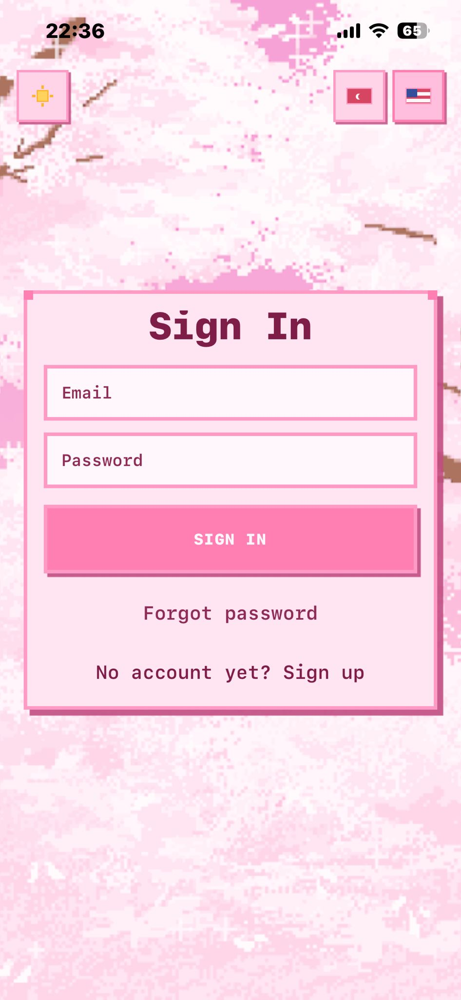
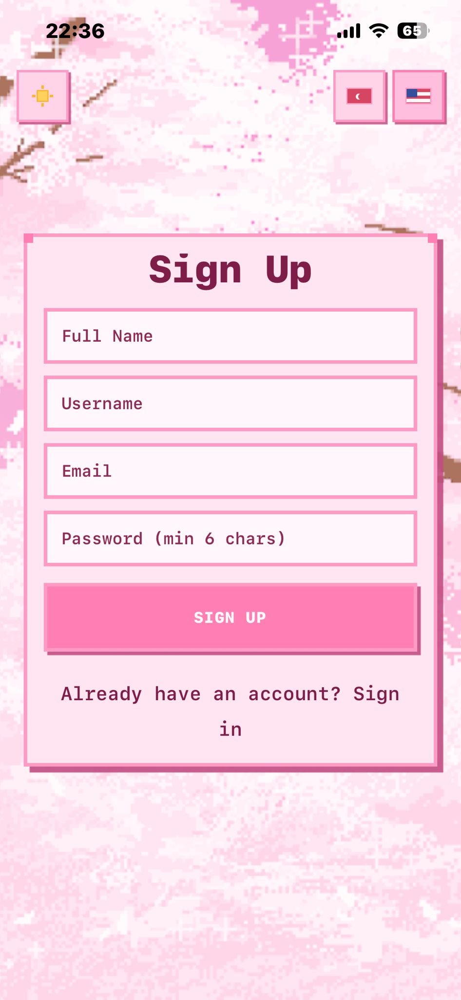
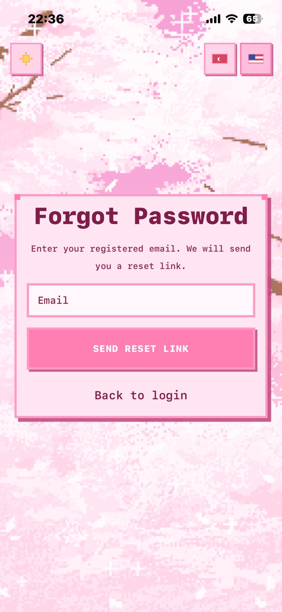
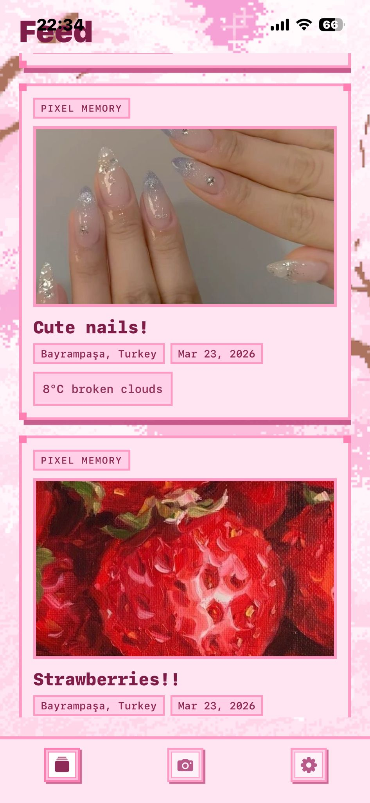
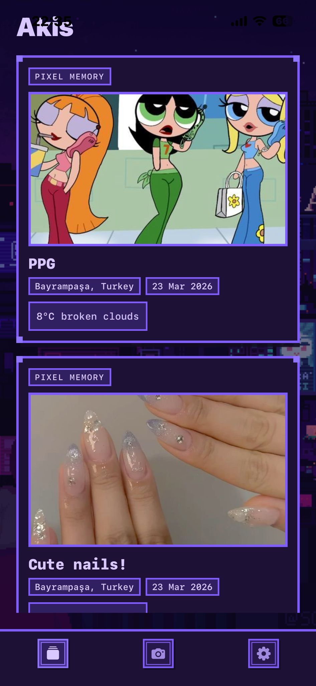
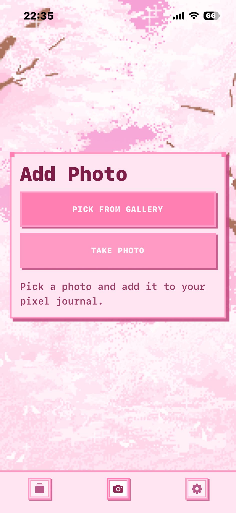
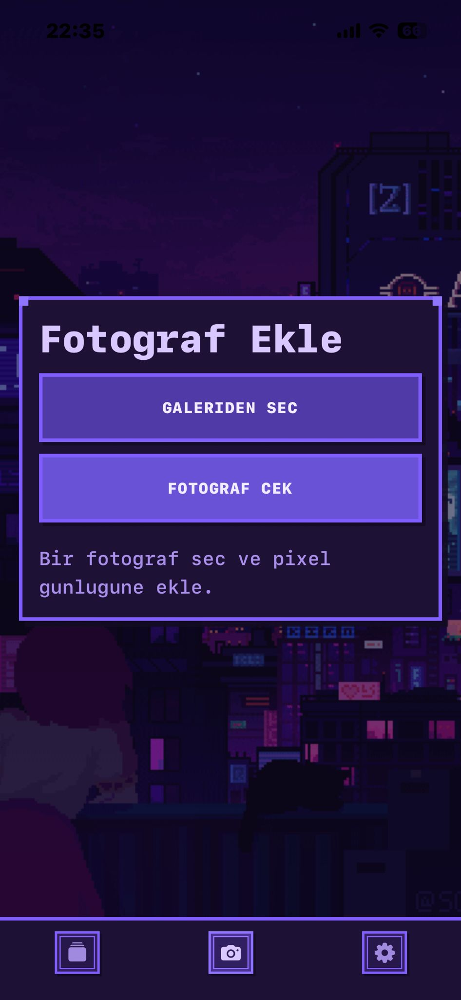
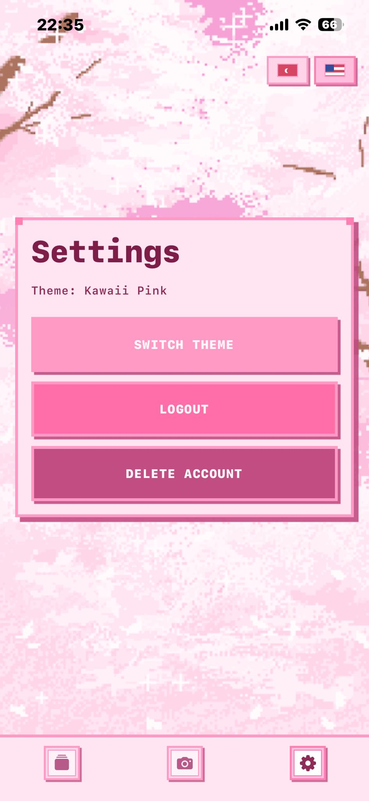
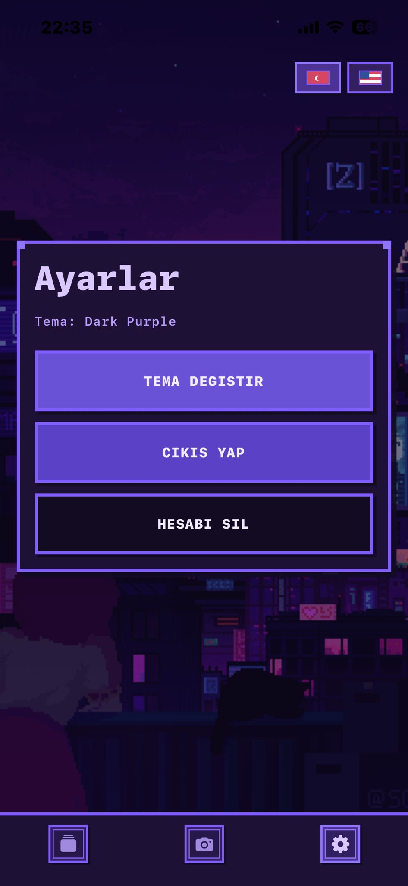

# Piclog

Piclog is a pixel-style photo journal built with Expo and React Native.

Users can create an account, capture or pick photos, add notes, and save memories with location and weather context. The app supports Turkish and English, plus two pixel themes (Kawaii Pink and Dark Purple).

## Features

- Email/password authentication with Supabase
- Register, login, resend confirmation email, and forgot-password flow
- Create posts by camera or gallery selection
- Attach note, current location, and weather info to each post
- Feed screen with signed image URLs from Supabase Storage
- Memory detail screen with delete action
- Account deletion flow (including data and storage cleanup)
- Pixel UI theme toggle: pink or purple
- Language switch: Turkish and English

## Tech Stack

- Expo SDK 54
- React Native 0.81 + React 19
- Expo Router (file-based routing)
- Supabase (Auth, Database, Storage)
- TypeScript
- AsyncStorage for local preferences

## Project Structure

Key folders:

- app: Routes and screens (auth, tabs, detail)
- src/services: Supabase, weather, geocoding services
- src/hooks: auth and location hooks
- src/i18n: in-app translations and language state
- src/theme: pixel theme provider and palette
- src/components: reusable UI components

## Prerequisites

- Node.js 18+
- npm
- Expo-compatible device/emulator
- A Supabase project
- OpenWeatherMap API key

## Environment Variables

Create a .env file in the project root and add:

```env
EXPO_PUBLIC_SUPABASE_URL=your_supabase_project_url
EXPO_PUBLIC_SUPABASE_ANON_KEY=your_supabase_anon_key
EXPO_PUBLIC_OPENWEATHER_API_KEY=your_openweather_api_key
```

Notes:

- EXPO*PUBLIC*\* variables are exposed to the client app by Expo.
- If weather key is missing, weather data is skipped gracefully.

## Supabase Setup

Run the SQL script in Supabase SQL Editor:

- supabase-profiles.sql

This script sets up:

- profiles table + RLS policies
- trigger to create profile rows on sign-up
- delete_my_account RPC function
- photos storage bucket + storage policies scoped to each user folder

Expected app tables used in code:

- logs
- profiles

The app stores uploaded images in the photos bucket under this path pattern:

- {user_id}/{timestamp}.{ext}

## Install and Run

1. Install dependencies:

```bash
npm install
```

2. Start development server:

```bash
npm run start
```

3. Run on specific targets:

```bash
npm run android
npm run ios
npm run web
```

## Available Scripts

- npm run start: Start Expo dev server
- npm run android: Open Android target
- npm run ios: Open iOS target
- npm run web: Open web target
- npm run lint: Run Expo lint checks

## Auth and Routing Overview

- app/(auth): login, register, forgot-password screens
- app/(tabs): authenticated feed, create, settings
- app/detail/[id]: memory detail screen

Tabs and detail flows are protected by auth checks in layout/screen logic.

## Screenshots

App screenshots are shown below:

### Auth





### Feed




### Create




### Settings




## Location and Weather

- Location is retrieved via expo-location.
- Reverse geocoding uses OpenStreetMap Nominatim.
- Weather uses OpenWeatherMap current weather endpoint.
- Localized responses are requested in Turkish or English based on current app language.

## Internationalization and Theme

- Language options: tr, en
- Theme modes: pink, purple
- Both language and theme are persisted in AsyncStorage

## Troubleshooting

- Login/Register works but data actions fail:
  - Verify Supabase URL and anon key in .env
  - Ensure SQL setup and policies are applied
- Photos do not appear:
  - Check photos bucket exists
  - Confirm storage policies allow user folder access
- Account deletion fails:
  - Ensure delete_my_account function exists
  - Confirm storage delete policy is active
- Weather info missing:
  - Check EXPO_PUBLIC_OPENWEATHER_API_KEY

## Linting

```bash
npm run lint
```
